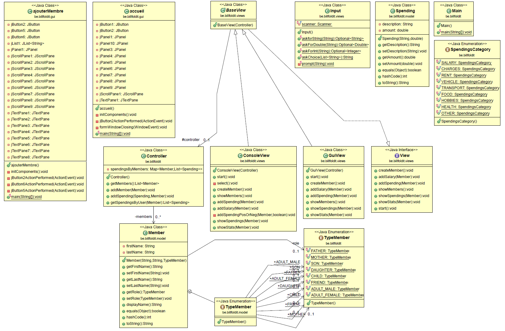
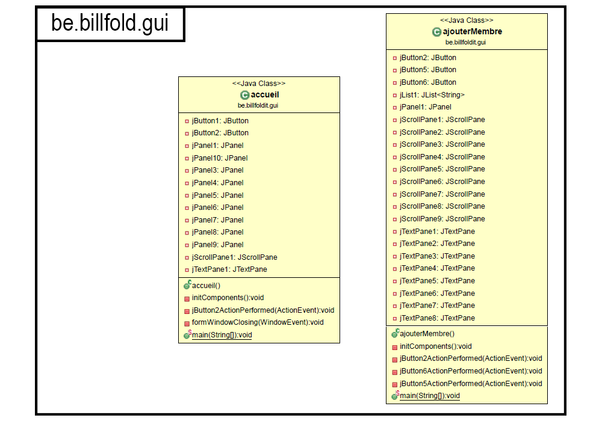
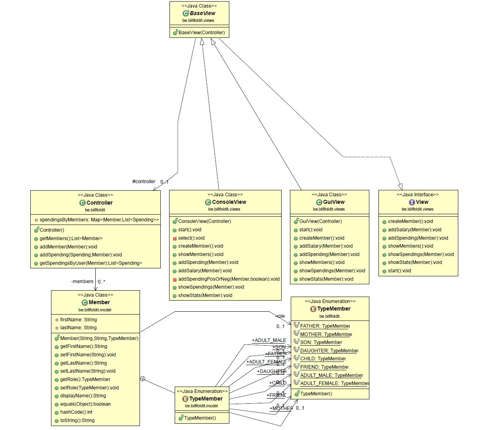
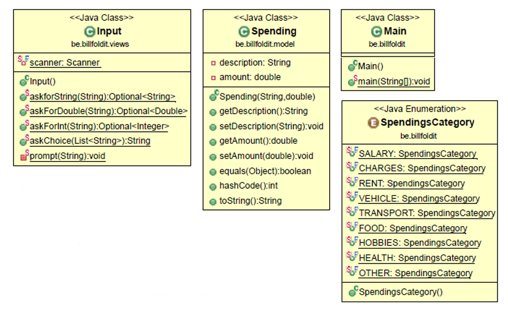

# Cahier des charges

## Objectifs

Pour appliquer les connaissances acquises pendant le cours de programmation avancée application et pour aborder les concepts des cours objets, nous sommes amenés à réaliser un projet informatique basé sur la technologie Java.

## Description générale du projet

Pour répondre à cet objectif, notre groupe a décidé de créer une application en Java, qui a comme but la gestion des ressources financières d’une famille.
Le but étant de mieux visualiser les dépenses et de pouvoir facilement les comparer, si besoin.

Cet outil doit intégrer les fonctionnalités suivantes :

* _**Base de données :**_ stockage des diverses informations
* _**MVC :**_ synchronisation de la vue et du contrôleur
* _**Module génération de rapport :**_ ajout/suppression de produits
* _**Module affichage console :**_ interaction en console
* _**Module affichage GUI :**_ interaction en interface graphique
* _**Module gestion famille**_

## Spécifications fonctionnelles

L’utilisateur va pouvoir démarrer l’application, créer son espace personnel et ensuite mettre son budget et ses dépenses.

Afin de faciliter son utilisation et dans le but d'éviter toute mauvaise manipulation par la suite, voici la solution retenue :

* _**Profil utilisateur**_
  * Pourra visualiser les activités payées,
  * Pourra distinguer les dépenses via sa carte bancaire et celles faites au comptant,
  * Pourra voir des graphiques de ses dépenses actuelles, et/ou sur l’année,
  * Il ne pourra pas modifier ses dépenses une fois inscrites, mais l’utilisateur devra vérifier deux fois les informations avant qu’elles soient enregistrées.

* _**Fonctionnement**_
  * Possibilité d’effacer son compte, une fois le mot de passe vérifié,
  * La possibilité d’exporter les résultats.

## Spécifications techniques

Du point de vue technique, nous allons travailler avec Java 13.
Afin de pouvoir l’utiliser librement du point de vue développement le JDK Oracle, nous avons besoin de [AdoptOpenJDK](https://adoptopenjdk.net/?variant=openjdk13&jvmVariant=hotspot).

En ce qu’il concerne la gestion de données, nous allons travailler avec MySQL.
Ce choix a été fait suite à une analyse de notre projet durant laquelle nous nous sommes rendu compte que nous avons besoin d’une base de données relationnelle.
Des BDDR nous avons comparé les plus populaires : MySQL, Oracle et PostgreSQL.
Oracle étant payant et PostgreSQL étant moins utilisés avec les applications Java, nous avons opté pour MySQL.

Pour la programmation de l’application, nous nous basons sur le cours de _« Développement Informatique avancée : application »_ de l’EPHEC, les formations Open Classrooms mais aussi la documentation en ligne que nous pouvons trouver auprès de Java et MySQL.

## Fonctionnement du groupe

La plateforme de développement, la documentation du projet, mais aussi notre avancement seront disponibles à partir des sites Internet suivants :

* <https://github.com/orgs/EphecLLN/teams/projetjava11>
* <https://trello.com/invite/b/hpUHWM1Q/660b222f45a6c916a045076930661c87/billfold-it>

La documentation est composée de plusieurs sections :

* _**In :**_ accueil de l’application, avec les divers membres et un bouton pour ajouter des nouveaux,
* _**Gestion :**_ section qui servira à voir :
  * Le budget restant,
  * Un champ pour introduire une nouvelle dépense et ses caractéristiques,
  * Une liste avec les dernières 3 entrées.
* _**Visualiser :**_ la section des graphiques qui affichera les dépenses d’une maniéré visuelle. Ces graphiques seront affichés en tant que pourcentages dans la console,
* _**À propos :**_ section wiki, permettant d’avoir des explications sur chaque page et de comment utiliser l’application,
* _**Questions :**_ section permettant d’envoyer un mail à l’adresse contant de l’application.

## L'équipe

L’équipe est formée de 3 membres.
Du point de vue des compétences, elles « frôlent le sol », en ce qu’il concerne le langage Java, mais nous avons tous commencé une formation sur Open Classrooms et nous avons aussi commencé à revoir le cours théorique.

Notre numéro de groupe est le 11.

Les membres sont : CAMPOS CASARES Melvin, MIRICA Constantin, PONJÉE Aymeric.

\pagebreak

# Diagrammes UML

A la suite, vous retrouverez ce diagramme découpé en plusieurs parties afin de mieux le parcourir.

Cette partie n'est pas reliée au reste du code étant donné qu'il n'est pas fini et que la personne en charge n'a pas eu le temps de l'intégrer correctement sur base du modèle MVC.

\pagebreak

\pagebreak

# Choix d'implémentation effectués

## JDK 13

Nous avons préféré travailler sur le JDK 13 de Java étant donné l'arrêt du support de Java 12 depuis septembre 2019.
Nous aurions pu travailler sur le JDK 11 de Java, car il s'agit d'une version en Long-Term-Support (LTS), comme l'est Java 8 de mars 2014 jusque mars 2022 (étendu à mars 2025), mais le cours pratique étant sous Java 12, il nous a semblé plus judicieux de travailler sous Java 13.

D'après l'article d'Oracle, Java 13 sera supporté jusqu'en mars 2020, laissant ensuite place à Java 14 : <https://www.oracle.com/technetwork/java/java-se-support-roadmap.html>.

Par ailleurs, nous avons préféré utiliser le Java Development Kit de AdoptOpenJDK afin de ne pas dépendre des décisions commerciales d'Oracle et ainsi rester sur un projet pleinement open source : <https://adoptopenjdk.net/>.

\pagebreak

# Pistes d'amélioration éventuelles

## Intégration d'un système de génération de graphiques

Nous avons découvert la librairie XChart, librairie fort intéressante, car permettant la génération de divers types de graphiques dont un qui, dans le cadre de ce projet, nous intéresse plus particulièrement : ["Pie Chart"](https://github.com/knowm/XChart#piechart).

Cette librairie est légère, open source et pratique pour tracer des données.
Elle est conçue pour passer des données aux graphiques en un minimum de temps et éviter de perdre inutilement du temps dans la personnalisation dans le style des graphiques.

* Un site web officiel permet de mieux comprendre certaines particularités : <https://knowm.org/open-source/xchart/>
* Le repository GitHub est disponible à l'adresse suivante : <https://github.com/knowm/XChart>

## Possibilité de se connecter à l'application via Internet

La mise en place d'un serveur pouvant être lancé avec comme option, la possibilité d'activer un serveur HTTP.
Ce serveur offrirait une liste des membres et des dépenses (possiblement en JSON) permettant ainsi d'être intégré dans d'autres programmes qui ne nécessitent pas d'utiliser Java.

Pour ce faire, une API JSON serait fort utile et sûrement le plus adapté si l'on souhaite rendre notre application accessible à toute personne désireuse de développer un concept autour.

\pagebreak

# Difficultés rencontrées

## JavaFX ou Swing ?

Au départ, nous voulions créer une interface graphique qui soit élégante et adaptée pour tout type d'écran.
JavaFX permet de contrecarrer les problèmes majeurs liés aux DPI des écrans (Windows et Linux impacté contrairement à macOS), entre autres choses.
Malheureusement, on a très vite remarqué un manque de temps crucial et nous avons préféré utiliser Swing.
L'IDE NetBeans a été utilisé, mais cela a occasionné un code très lourd, difficile à séparer et à intégrer à notre projet, ce qui nous a permis de comprendre l'intérêt minime des systèmes WYSIWYG (What You See Is What You Get).

## Java 13

Les particularités liées à Java 13 comme, entre autres, la possibilité d'utiliser des attributs `var` ont été des découvertes pour nous.
Nous avons dû parcourir la documentation liée aux changements apportés à cette nouvelle version afin de garder une certaine constance et réellement profiter de l'utilisation de la nouvelle version du langage Java plutôt que d'utiliser le dernier Development Kit tout en écrivant du code typé Java 8.

## Gestion du planning

Au niveau de la gestion du temps, cela n'a pas été notre point fort.
Nous pensions avoir suffisamment de temps au départ, mais c'était sans compter les projets de 3ème année (projet d'intégration, base de données), les débuts du travail de fin d'études, le choix du stage avec les meetings lié, ainsi que l'examen hors session du cours de _gestion de projet avancée_.
Tout cela a entrainé une certaine inconsistance au niveau du planning et une avancée ralentie de ce projet.

La mise en place d'un Trello ne nous a pas aidés à contrecarrer ce problème.

\pagebreak

# Conclusion

## Melvin Campos Casares

J'ai trouvé le sujet de ce projet très intéressant et même si j'étais fort motivé au départ pour le mener à bien, avec les différents cours et projets de ce quadrimestre, il m'a été impossible de consacrer plus de temps.

Comme décidé avec le groupe, nous avons chacun suivi une formation en ligne concernant le langage de programmation Java.
Ayant réussi le cours théorique l'an passé, contrairement au cours pratique, je m'étais dit que ce serait l'occasion de rattraper mes lacunes de façon proactive, mais ce ne fut pas suffisant pour compenser la mauvaise gestion rencontrée.

## Constantin Mirica

## Aymeric Ponjée

Je trouve que faire un projet dans ce cours est super intéressant car c'est, selon moi, le meilleur moyen d'apprendre. C'est pendant les projet que nous apprenons à nous débrouiller et à trouver des choses que nous n'apprenons pas en cours. Malheureusement, je n'ai pas pu investir le temps voulu dans le projet à cause des autres cours et malgré la politique de l'école où nous devons travailler en prioriter les cours du bloc inférieur je n'ai pas réussi à gerer mon temps.
